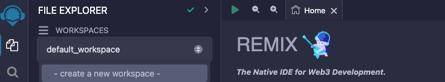

# Remix

In order to use the scripts in the [remix](../remix) folder, you will need to import them into the [Web Remix IDE](https://remix.ethereum.org/).
The scripts are designed to be run in the web version of the Remix IDE as they require interaction with a wallet (MetaMask)
to sign the transactions.
The MetaMask wallet needs to have [added _eon_ or _gobi_ networks](https://docs.horizen.io/horizen_eon/connect/connect_your_wallet/).

## Environment Variables

In each script there is a section at the top that can be edited in order to set the environment variables. Some scripts like the getAllForgerStakes do not need 
any environment variable to be set.

## Usage

Follow these steps in order to use the scripts in the [remix](../remix) folder:

1. Clone this repository or download as a zip and extract.
2. Open the [Web Remix IDE](https://remix.ethereum.org/).
3. Create a new workspace.

   

4. Import the scripts from the [remix](../remix) folder using the "upload folder" functionality.

   

5. [Connect your Metamask wallet to EON or GOBI networks](https://docs.horizen.io/horizen_eon/connect/connect_your_wallet/) 
and select the network you want to interact with (eon or gobi) and the address you want to use.

6. Connect your MetaMask wallet to the [Web Remix IDE](https://remix.ethereum.org/). Select injected provider in Web Remix IDE

   

7. Open the script you want to run, set up the required environment variables in the script if necessary, and run the script.

