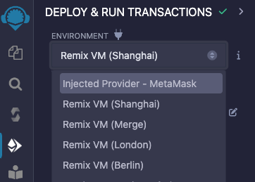

# FORGER STAKE DELEGATION

## Overview

Code to interact with the Eon sidechain forger stake delegation smart contract.

It provides two different ways to interact with the smart contract:
1. [remix](./remix) - A set of scripts that can be imported into the Remix IDE to interact with the smart contract.
2. [js](./js) - A script that can be run using Node.js locally to interact with the smart contract.

## Remix

In order to use the scripts in the [remix](./remix) folder, you will need to import them into the [Web Remix IDE](https://remix.ethereum.org/). 
The scripts are designed to be run in the web version of the Remix IDE as they require interaction with a wallet (MetaMask) 
to sign the transactions.
The MetaMask wallet needs to have [added _eon_ or _gobi_ networks](https://docs.horizen.io/horizen_eon/connect/connect_your_wallet/).

Follow these steps in order to use the scripts in the [remix](./remix) folder:
1. Clone this repository or download as a zip and extract.
2. Open the [Web Remix IDE](https://remix.ethereum.org/).
3. Create a new workspace.

    

4. Import the scripts from the [remix](./remix) folder using the "upload folder" functionality.

   

5. [Add the _eon_ or _gobi_ network](https://docs.horizen.io/horizen_eon/connect/connect_your_wallet/) to MetaMask.
6. Select the network you want to interact with (eon or gobi) in MetaMask wallet.

   

7. Connect your MetaMask wallet to the [Web Remix IDE](https://remix.ethereum.org/). Select injected provider in Web Remix IDE

    

8. Open the script you want to run

    

9. Set up the required environment variables in the script if necessary (see below).

    

10. Run the script in the [Web Remix IDE](https://remix.ethereum.org/)

    

### Required Environment Variables

#### Delegate script
In the [delegate script](./remix/delegate.js), you will need to set the following environment variables:
- `AMOUNT` - The amount of ZEN of the new stake
- `YOUR_BLOCK_SIGN_PUBKEY` - The public key that will sign the block when forged; populate this with the value of "Block Sign Public Key" from the forger you will delegate to.
- `YOUR_VRF_PUBKEY` - The "VRF Public Key" from the forger you will delegate to.

#### Withdraw script
In the [withdraw script](./remix/withdraw.js), you will need to set the following environment variables:
- `STAKE_ID` - The stakeId to withdraw
- `OWNER_ADDRESS` - If owner is different from caller, specify it here. Consider that the owner has to create the signature for the message in order to allow the caller to send the transaction.
- `OWNER_SIGNED_MESSAGE` - If the owner has already signed the message, paste the signature here. If not, leave it empty and the script will sign the message.

#### StakeOf script
In the [stakeOf script](./remix/stakeOf.js) you will need to set the following environment variables:
- `OWNER_ADDRESS` - Address to get stake from.

#### getPagedForgersStakes script
In the [getPagedForgersStakes](./remix/getPagedForgersStakes.js) script you will need to set the following environment variables:
- `START_INDEX` - Index to start from. Default is 0.
- `PAGE_SIZE` - Page size to return. Default is 10.

#### getPagedForgersStakesByUser script
In the [getPagedForgersStakesByUser](./remix/getPagedForgersStakesByUser.js) script you will need to set the following environment variables:
- `OWNER_ADDRESS` - Address to get stakes from.
- `START_INDEX` - Index to start from. Default is 0.
- `PAGE_SIZE` - Page size to return. Default is 10.

## JS

In order to use the scripts in the [js](./js) folder, you will need to have Node.js installed on your machine. 
The scripts are designed to be run using Node.js and will interact with the smart contract using the Web3.js library.
You will need to export your private key from your wallet and set it as an environment variable.

**BE CAREFUL WITH YOUR PRIVATE KEY, DO NOT SHARE IT WITH ANYONE, AND BE CAREFUL WHERE YOU STORE IT.**

Follow these steps in order to use the scripts in the [js](./js) folder:
1. Clone this repository
2. ```shell
    cd contracts/forger_stake_delegation/js
    npm install
    cp .env.template .env
    ```
3. Set the required environment variables for the operation you want to perform (see below).
4. ```shell
    npm run start
    ```
5. Follow the instructions in the terminal.

### Required Environment Variables

#### General
- `NETWORK` - The network to connect to. Can be `eon` or `gobi`

### Transaction
- `FROM_ADDRESS` - The address that will send the transaction
- `PRIVATE_KEY` - The private key of the address that will send the transaction. Required to sign the transaction.
- `MAX_PRIORITY_FEE_PER_GAS` - The maximum priority fee per gas for the transaction.
- `MAX_FEE_PER_GAS` - The maximum fee per gas for the transaction.
- `GAS_LIMIT` - The gas limit for the transaction. This value is used for withdraw operation. See notes below.

#### Delegate script
In order to run the delegate operation you will need to set the following environment variables:
- `AMOUNT_TO_SEND` - The amount of ZEN of the new stake
- `BLOCK_SIGN_PUBLIC_KEY` - The public key that will sign the block when forged; populate this with the value of "Block Sign Public Key" from the forger you will delegate to.
- `FORGER_VRF_PUBLIC_KEY` - The "VRF Public Key" from the forger you will delegate to.

#### Withdraw script
In order to run the withdraw operation you will need to set the following environment variables:
- `STAKE_ID` - The stakeId to withdraw
- `OWNER_ADDRESS` - Optional. If not set, it will be the same as FROM_ADDRESS.
- `OWNER_PRIVATE_KEY` - Optional. If not set, it will be the same as PRIVATE_KEY. If OWNER_SIGNED_MESSAGE is set, it will be ignored. 
- `OWNER_SIGNED_MESSAGE` - Optional. If the owner has already signed the message, paste the signature here, it will be used instead of signing the message with OWNER_PRIVATE_KEY. If not, leave it empty and the script will sign the message.

#### StakeOf script
In order to run the stakeOf operation you will need to set the following environment variables:
- `STAKE_OF_OWNER_ADDRESS` - Address to get stake from.

#### getPagedForgersStakes script
In order to run the getPagedForgersStakes operation you will need to set the following environment variables:
- `PFS_START_INDEX` - Index to start from. Default is 0.
- `PFS_PAGE_SIZE` - Page size to return. Default is 10.

#### getPagedForgersStakesByUser script
In order to run the getPagedForgersStakesByUser operation you will need to set the following environment variables:
- `PFSBU_OWNER_ADDRESS` - Address to get stakes from.
- `PFSBU_START_INDEX` - Index to start from. Default is 0.
- `PFSBU_PAGE_SIZE` - Page size to return. Default is 10.

## Notes

### Withdraw operation

Withdraw operation has two known issues:

- It requires to sign a message with the owner private key. This implies that, if using MetaMask to sign (remix), _eth_sign_ needs to be enabled in MetaMask.
- The message to sign requires to be hashed with `web3.utils.sha3()` algorithm, which is not the same algorithm used by `web3.eth.accounts.sign()`.
- The gas limit calculation fails, so a static value needs to be used. The script will use the value set in the .env file, but it may not be enough. If the transaction fails with an out of gas error, the script will print the gas used in the failed transaction. You can use that value to set the GAS_LIMIT in the .env file and try again.

